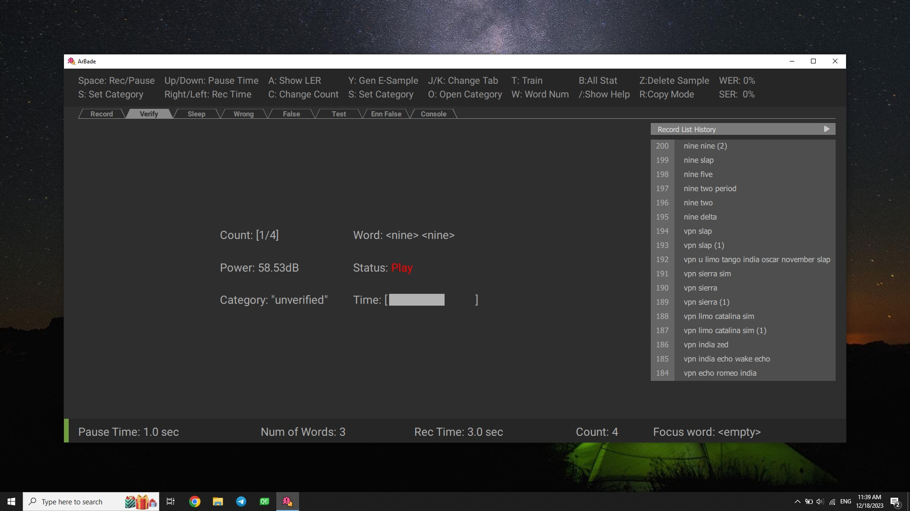

## Verification

When you are using Benjamin regularly, samples will be generated when issueing commands or recorded when in sleep mode saying ordinary words. To use these samples, you need to assure that they are matched with the detected words. For verifying these samples you can switch to Verify tab and press `space` to start verification process. While verifying sleep mode samples, make sure that all words are detected wrong. Verifying 

If the sample is wrong press `Z` to delete sample, while playing or at `Decide Pause` status after voice stopped. By default after playing each sample in `unverified` category, if there wasn't any key press, the sample will be verified. you can change this behavior by pressing `R`.
