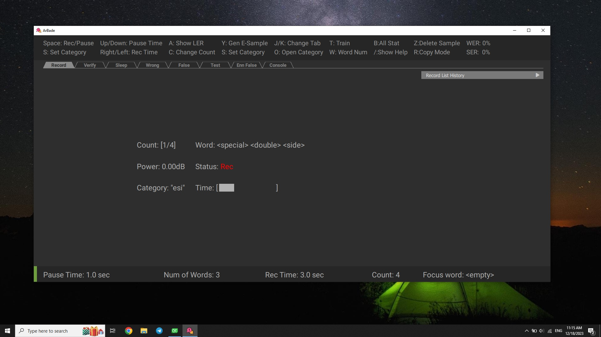
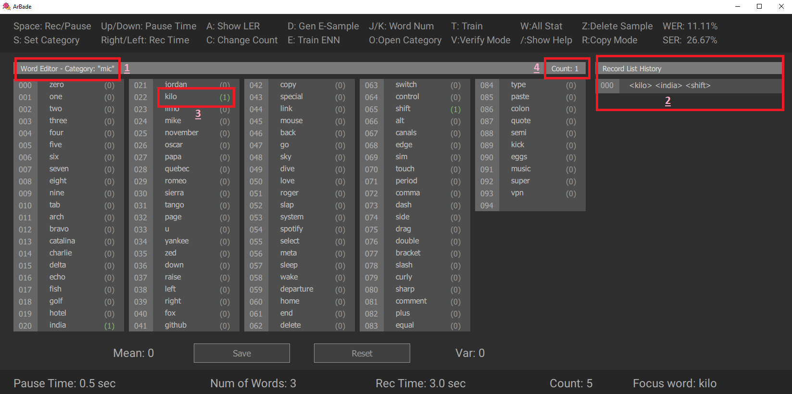

1. specify a category name by pressing `S`. category name is used to distinguish between speaker or microphone.

2. Start to record by pressing `space`. Say the words specified between `<>` while status is `Rec`.

You can pause the Record procedure any time by using `space` and get out of record panel by pressing `Escape`. Then Statistics will be updated.

1. Arbitrary name of category.
2. Record list showing the samples recorded.
3. Word list showing how many samples include the specific word.
4. sample count in specific category.

### More Info
A detailed description of **ArBade** functionalities is discussed in the [User Guide](Capture-Audio-Samples/ug.md).