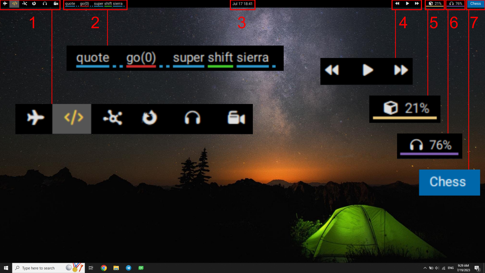

BaTool is a real-time speech recognition engine, that gets a triphone Kaldi model and do a low latency speech recognition on the data coming from the system default microphone.

## BaTool Conf
Batool is configurable via `conf` file next to BaTool application. It has 4 main sections to configure:

### Model Section: 
This section defines the location of Kaldi model files. The addresses are relative to where BaTool application exists.

    ; Model path
    [model]
    fst = "Model/HCLG.fst"
    mdl = "Model/final.oalimdl"
    word = "Model/words.txt"
    cmvn = "Model/global_cmvn.stats"

### Decoder Section:
Kaldi related decoder settings.

    max_active = 900
    min_active = 200
    train_max = 5
    ac_scale = 0.05
    min_sil = 20

- `train_max`: Maximum number of same samples for later training.
- `min_sil`: Minimum silence before detection. This value directly connected with accuracy and latency.

## Topbar

Mom is like [PolyBar](https://github.com/polybar/polybar), it manages different workspace, shows system status and `BaTool` detection output. Mom is named after the fact that it will spawn all the child applications (BaTool, Chess, Rebound). Mom reads BaTool detection from `Benjamin/Mom/Labels` with [PolyBar Application format](https://github.com/polybar/polybar/wiki/Formatting). 

Mom has several widgets:

1. Workspaces: you can switch between 6 workspaces showed with different icons.
2. Word detection from `BaTool` and `ENN`.
3. Date and time
4. Music widget: Used to pause/play music. Also go to next/previous music.
5. CPU usage
6. Speaker: By clicking on this icon you can alter between speaker and headphone. By scrolling you can increase/decrease the volume.
7. Focused application
7. System status: Shows if system is running or sleeping or halted.

Color of detected word is set by `ENN` application and sorted from best detection accuracy to worst:

* Best
* Good
* Lowest Confidence
* Wrong