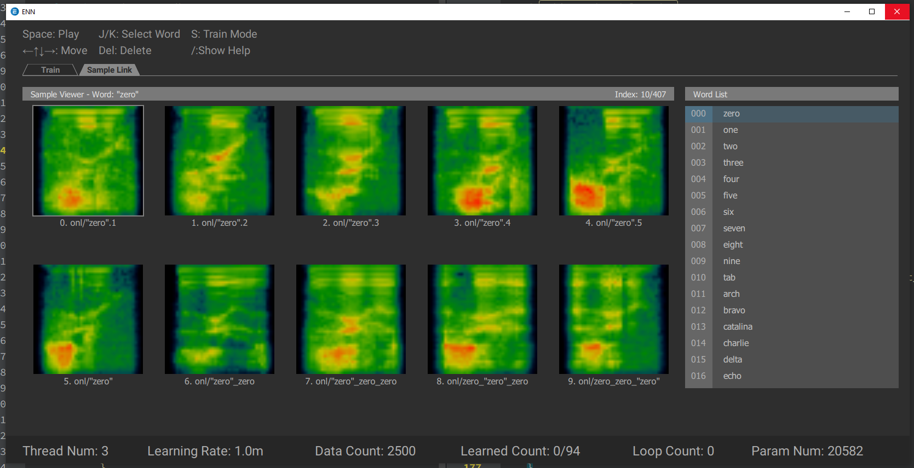

# ENN

ENN generates neural network model from ENN samples. ENN samples are Cepstrums that were normalized and aligned to a single word saved as a simple 40x40 binary array.

we feed this to a convolutional neural network followed by a fully connected layer to detect out of vocabulary words.

ENN is an optional feature that brings more accuracy and let you leave the system on always, so you don't need to say wake up words.

ENN user interface includes these main tabs:

* Train
* Sample Link
* Wrong

## ENN Train

In Train Tab you can watch the learning procedure of each word. In train Panel, learning loss and test loss is shown for first 4 words in wordlist panel. You can watch other word loss plots by pressing Up/Down arrow keys on keyboard. Hover on each word in word list panel to see how many samples are trained from total samples. Also you can sort the model statistics based on train precision, test precision and loss by clicking relevant table header (to reset the sort method click on ID header). Learned models will be saved in `Model` directory.

### Parameters

* Thread Num: Number of concurrent words to learn. (Be careful to set it lower than your number of CPU cores to prevent windows freeze)

* Learning rate: Base learning rate for each word to start training.

* Target Loss: Loss that model is considered learned.

* Param Num: Number of parameters the model has to learn.

* True Count: Number of ENN samples in `enn/true` directory.

* False Count: Number of ENN samples in `enn/false` directory.

* Learned Count: Number of words that their loss become less than target loss.

* Loop Count: Training for each word takes 200 epoch, if target loss not reached. Then next word's training procedure starts. After all words training finished, program will start from first word and increases loop count.

* Train Time: Time that program is training words.

## ENN Sample Link

In sample link tab all true sample Cepstrums are plotted in images. In this way you can find out why training for a word has large loss and not reaches the target loss.
By using direction arrow keys you can select then play the wave related to each sample. Also change the word to see its samples. (Train procedure is not stopped while sample link is active)

## Wrong

In training procedure, some samples couldn't be learned, they will be stored in `Models/Wrong` directory. For each model there is a relevant `.wrong` file that is filled by all failed samples. In the same way as `Sample Link` you can watch wrong detected sample Cepstrums and here relevant recorded wave. The label for each sample is shown in right bottom corner of its Cepstrum.