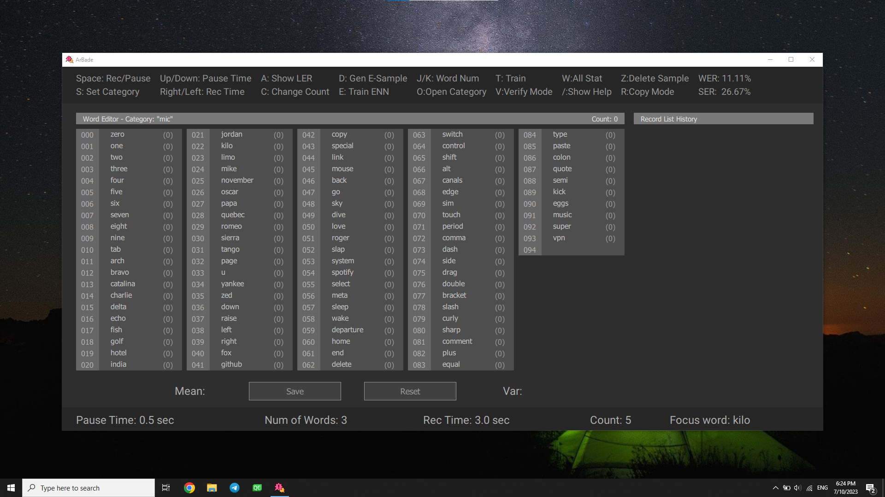
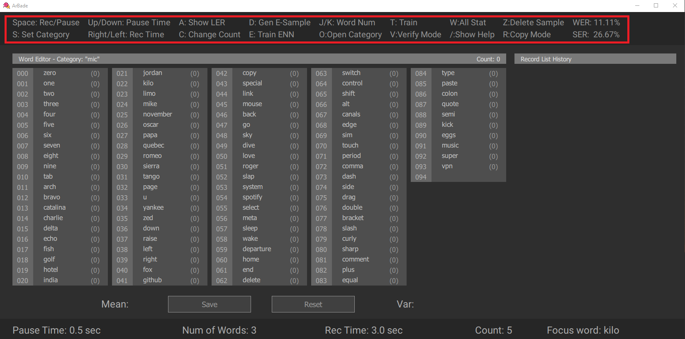
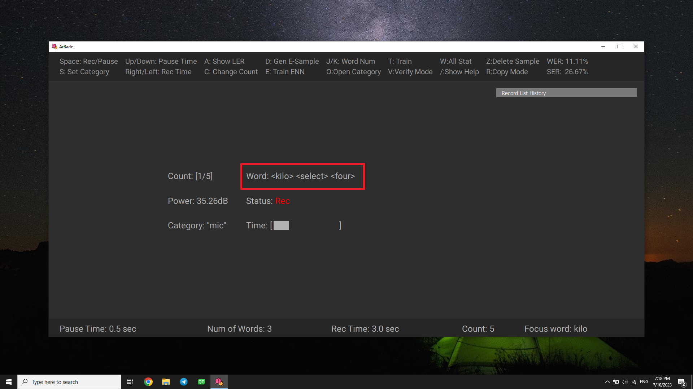
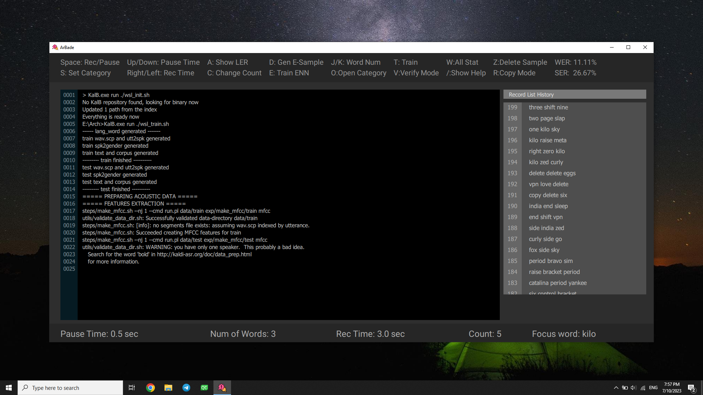
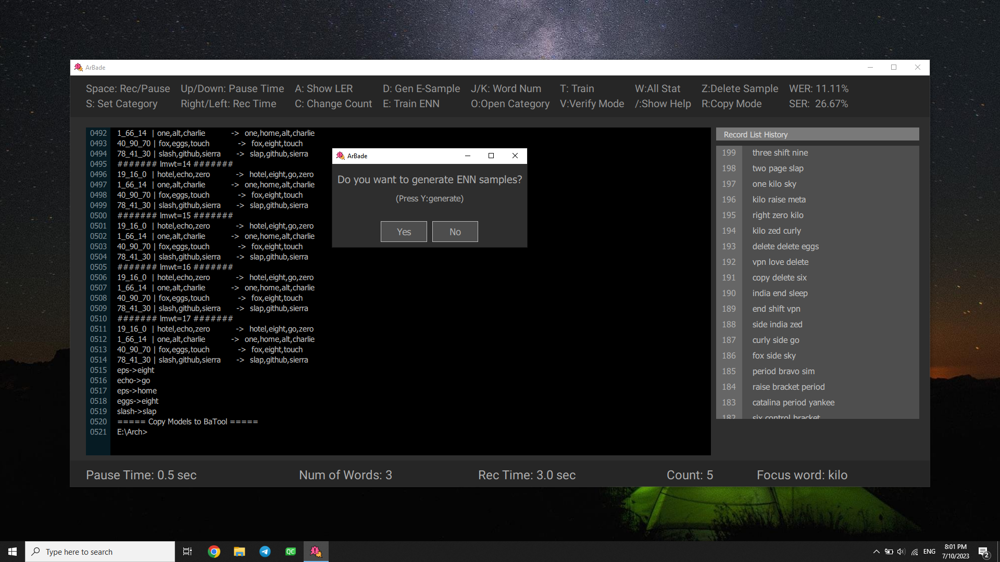
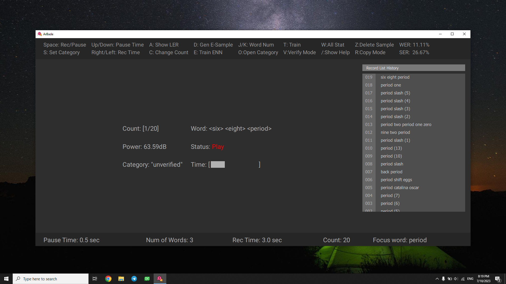

# Quick Start

At very first glance you confront this environment:

As an early user to every application, you need to know its shortcuts. There is a bar, top of application below title bar, that has most useful shortcuts.

Also if you want to see all shortcuts, by clicking `/` a help window will appear.

If this is your first time using Benjamin, You need to train a model from your voice. Now it's time to follow the main steps of using this application.

## Record Samples

First you should specify a category to work with. As a new user there isn't any categories on your computer so by clicking `S` enter a category name.

Then start to record by clicking `space`. Say the words specified between `<>` while status is `Rec`.

You can pause the Record procedure any time by using `space` and get out of record panel by pressing `Escape`. Then Statistics will be updated.

1. Arbitrary name of category.
2. Record list showing the samples recorded.
3. Word list showing how many samples include the specific word.
4. sample count in specific category.

Detailed description about record parameters and procedure can be found in [User Guide](ug.md)

## Train on Samples

After recording appropriate number of samples, you are ready to experience the first Benjamin train. Press `T` and the terminal will show up.

At any time outside of terminal, by pressing `P` you can access the results of running train scripts in terminal. All the train procedure is automatic and you should only wait for the dialog indicating train is finished and now it's ENN samples generation turn.

Detailed description about train steps and procedure can be found in [User Guide](ug.md)

## Verification

When you are using Benjamin regularly, many samples will generate when issueing commands. all of these samples are useful for training, but you need to assure that these samples are matched with expected words. for verifying such samples you can press `V` and to change the category to `unverified` and press `space` to play the sample.

You can press `Z` to delete sample while playing, or at `Decide Pause` status after voice stopped. By default after playing each sample in `unverified` category, if there wasn't key press, the sample will be copied from `unverified` to `online` category. you can change this behaviour by pressing `R`.

Detailed description about verification parameters and procedure can be found in [User Guide](ug.md)

    Congrats! Now you know the very initial steps to work with ArBade!