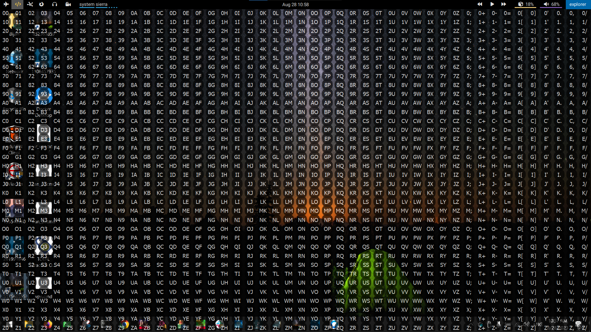

# Chess

In the following image you can see `chess` in action.

Chess supports following commands:

* Kick: Normal left click button
* Side: Right click button
* Drag: Drag with left click between two points.
* System Sierra: Take screenshot between two points and put it in clipboard
* Comments: Open chess on second monitor